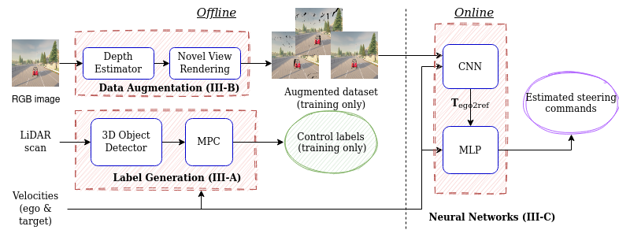

#  Autonomous-Vehicle-Pursuit
## Robust Autonomous Vehicle Pursuit without Supervised Steering Labels 

 This repository contains code for the paper **Robust Autonomous Vehicle Pursuit without Supervised Steering Labels** submitted to IEEE Robotic Automation Letter. 



In this work, we present a learning method for lateral and longitudinal motion control of an ego-vehicle for the task of vehicle pursuit. 
To train our model, we do not rely on steering labels recorded from an expert driver, but effectively leverage classical controller as an offline label generation tool.
In addition, we account for the errors in the predicted control values, which can lead to crashes of the controlled vehicle. 
To this end, we propose an effective geometry-based data augmentation approach, which allows to train a network that is capable of handling different views of the target vehicle. 

During the pursuit,  target pose of the followed vehicle with respect to the ego-vehicle is firstly estimated using a Convolutional Neural Network. 
This information is then fed to a Multi-Layer Perceptron, which regresses the control commands for the ego-vehicle, namely throttle and steering angle. 
We extensively validate our approach using the CARLA simulator on a wide range of terrains and weather conditions. 
Our method demonstrates real-time performance, robustness to different scenarios including unseen trajectories and high route completion.

## Results

Here we show videos to show the qualitative results of our approach **in different maps**, in a city (left) and in the countryside (right). 
To summarize, the first vehicle (red) in the video is controlled by autopilot. The ego-vehicle (black) is controlled autonomously with our method to follow the red target vehicle.
<div align="center"></div>  

We further tested our model with **two ego vehicles**. As can be seen in the ego vehicle, the first vehicle (red) is controlled by autopilot, the first ego-vehicle (gray) is controlled by our model to follow the red target vehicle. And the second ego-vehicle (black) is controlled by the same model to follow the gray ego-vehicle.
<div align="center"></div>  

Though the model is trained only with samples in sunny weather, it fits **different weather conditions** quite well. Here we show two examples, in dark night (left) and rainy weather (right).
<div align="center"></div>  


## Environment

Clone the repo, setup CARLA 0.9.11, and build the conda environment:

```
conda create -n myenv python=3.7 
conda activate myenv
conda install --file requirements.txt
```

For installation of pytorch3d, you can refer to [Pytorch3d - Tutorial](https://pytorch3d.org/tutorials/bundle_adjustment)

For installation of CARLA 0.9.11, you can refer to [CARLA 0.9.11](https://github.com/carla-simulator/carla#building-carla)

### Licences
**CARLA licenses**

CARLA specific code is distributed under MIT License.
CARLA specific assets are distributed under CC-BY License.

## Data Collection
If CARLA server is not running in the other terminal, client script will also not run. Thus, first start the CARLA server with (By default connected to port 2000)
```
./CarlaUE4.sh
```
To try data collection, note that data collection script must be placed under path <code>path_to_Carla_folder>/CARLA/Carla_0.9.11/PythonAPI/examples/...</code>, then run [data_collection_CARLA.py](data_collection/data_collection_CARLA.py) to collect data from a default starting point in a town map, e.g. 

```
python data_collection_CARLA.py -town 4  -start_point 30
```

## Data Augmentation
Example synthesized views with longitudinal, lateral and rotational offset
<div align="center"></div>  
&nbsp;

To try data augmentation, run [rendering.py](data_augmentation/rendering.py)

```
python rendering.py --rgb-path <path to RGB images> --depth-path <path to depth maps> --out-path <output path> --txt-path <path to the txt file saved by data collection>
```

Example augmentation dataset is provided under [rendering example](data_augmentation/rendering_example/), to try the example, simply run

```
python rendering.py --rgb-path ./rendering_example/RGB --depth-path ./rendering_example/Depth --out-path ./rendering_example/Output --txt-path ./rendering_example/txt/data.txt
```

## Training
To run the training script, run training.py [training.py](train.py). The resource of depth map and relative transformation can be switched by setting arugments<code>depth, relative_transform</code>. Other configurations for training, such as batch size, can be changed in corresponding .json config files.  
An example of running the training script:
```
python training.py -depth cdn -relative_transform rcnn -image_dir path/to/augmented/images -label_file path/to/label/file
```

## Inference and Evaluation

**Steps:**
1. The inference needs to run with the CARLA simulator, please place [inference folder](inference) under path <code><path_to_Carla_folder>/CARLA/Carla_0.9.11/PythonAPI/examples/</code>. 
    
2. Before running the inference script, it is necessary to start the CARLA simulator. 
    
3. Evaluation result will be saved to **evaluation.txt** and **evaluation.xls** under path <code>inference/output/</code>. Both will be created automatically if not existing.

**Arguments:**

1. Extra impulses could be added to the ego vehicle during inference, level could be specified with argument <code>-impulse_level</code> in range [0, 0.5].

2. The following town numbers and spawn points are picked for inference, rare overlapping with trajectories in the training dataset. Inference trajectory could be specified by arguments <code>-town</code> and <code>-spawn_point</code>. Using flag <code>--all</code> would automatically run inference for all trajectories.

| Town Number | Spawn Point Number | 
| :-----:| :----: | 
| 1 | 100 | 
| 1 | 150 | 
| 3 | 0 | 
| 3 | 112 | 
| 3 | 200 | 
| 4 | 280 | 
| 4 | 368 | 
| 5 | 2 | 
| 5 | 100 | 
| 5 | 150 | 

```
python <path to the inference folder>/evaluation_cnnmlp_offline_impulses.py -cnn_path <path to the trained cnn model>, -mlp_path <path to the trained mlp model> -town <town number> -spawn_point <spawn point number> -impulse_level <impulse level number> 
```

## Pretrained models:

| Model | CNN/MLP | Path|
| :-----:| :----: | :----: |
| Baseline | CNN | models/pretained_models/Baseline.pth |
| Three-camera | CNN | models/pretained_models/Three-camera.pth |
| SS depth + 3D detector (our approach) | CNN | models/pretained_models/SS_depth+3D_detector.pth |
| Stereo depth + 3D detector (our approach) | CNN | models/pretained_models/Stereo_depth+3D_Detector.pth |
| ground truth depth + 3D detector | CNN | models/pretained_models/GT_depth+3D_detector.pth |
| SS depth + ground truth transformation | CNN | models/pretained_models/SS_depth+GT_transformation.pth |
| Stereo depth +  ground truth transformation | CNN | models/pretained_models/Oracle.pth |
| Oracle | CNN | models/pretained_models/Stereo_depth+3D_Detector.pth |
| Random Noise Injection | CNN | models/pretained_models/Random_Noise_Injection.pth |
| MLP | MLP | models/pretained_models/MLP.pth |
